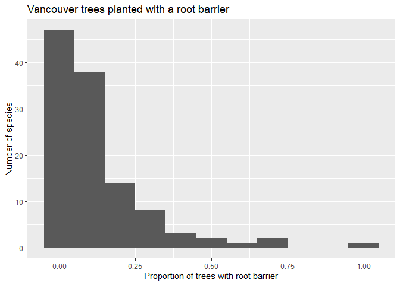
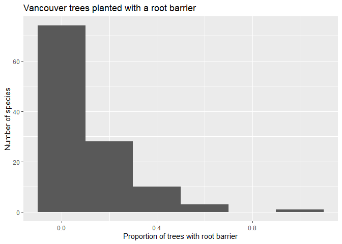
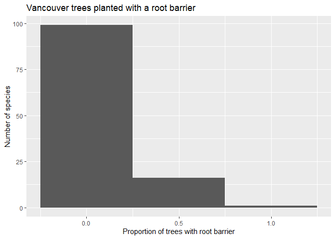
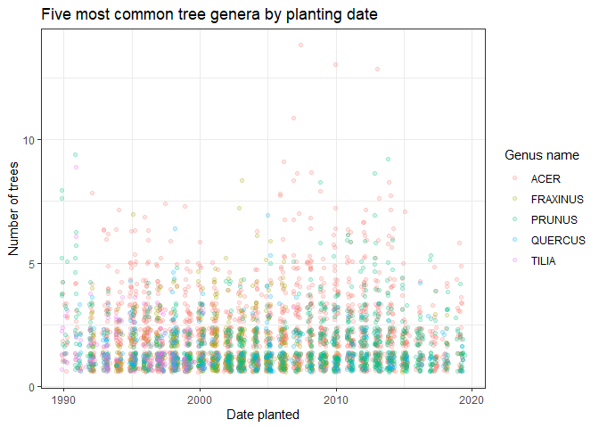
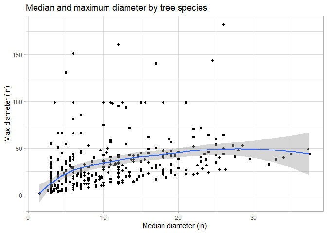
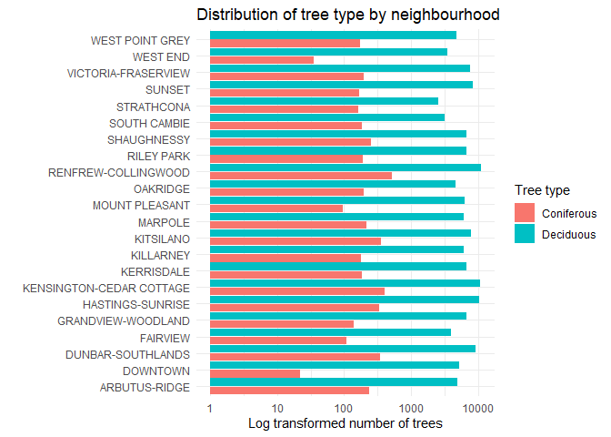

Mini Data Analysis Milestone 2
================

*To complete this milestone, you can either edit [this `.rmd`
file](https://raw.githubusercontent.com/UBC-STAT/stat545.stat.ubc.ca/master/content/mini-project/mini-project-2.Rmd)
directly. Fill in the sections that are commented out with
`<!--- start your work here--->`. When you are done, make sure to knit
to an `.md` file by changing the output in the YAML header to
`github_document`, before submitting a tagged release on canvas.*

# Welcome to the rest of your mini data analysis project!

In Milestone 1, you explored your data. and came up with research
questions. This time, we will finish up our mini data analysis and
obtain results for your data by:

- Making summary tables and graphs
- Manipulating special data types in R: factors and/or dates and times.
- Fitting a model object to your data, and extract a result.
- Reading and writing data as separate files.

We will also explore more in depth the concept of *tidy data.*

**NOTE**: The main purpose of the mini data analysis is to integrate
what you learn in class in an analysis. Although each milestone provides
a framework for you to conduct your analysis, it’s possible that you
might find the instructions too rigid for your data set. If this is the
case, you may deviate from the instructions – just make sure you’re
demonstrating a wide range of tools and techniques taught in this class.

# Instructions

**To complete this milestone**, edit [this very `.Rmd`
file](https://raw.githubusercontent.com/UBC-STAT/stat545.stat.ubc.ca/master/content/mini-project/mini-project-2.Rmd)
directly. Fill in the sections that are tagged with
`<!--- start your work here--->`.

**To submit this milestone**, make sure to knit this `.Rmd` file to an
`.md` file by changing the YAML output settings from
`output: html_document` to `output: github_document`. Commit and push
all of your work to your mini-analysis GitHub repository, and tag a
release on GitHub. Then, submit a link to your tagged release on canvas.

**Points**: This milestone is worth 50 points: 45 for your analysis, and
5 for overall reproducibility, cleanliness, and coherence of the Github
submission.

**Research Questions**: In Milestone 1, you chose two research questions
to focus on. Wherever realistic, your work in this milestone should
relate to these research questions whenever we ask for justification
behind your work. In the case that some tasks in this milestone don’t
align well with one of your research questions, feel free to discuss
your results in the context of a different research question.

# Learning Objectives

By the end of this milestone, you should:

- Understand what *tidy* data is, and how to create it using `tidyr`.
- Generate a reproducible and clear report using R Markdown.
- Manipulating special data types in R: factors and/or dates and times.
- Fitting a model object to your data, and extract a result.
- Reading and writing data as separate files.

# Setup

Begin by loading your data and the tidyverse package below:

``` r
library(datateachr) # <- might contain the data you picked!
library(tidyverse)
```

    ## Warning: package 'tidyverse' was built under R version 4.3.1

    ## Warning: package 'tidyr' was built under R version 4.3.1

    ## Warning: package 'readr' was built under R version 4.3.1

    ## Warning: package 'purrr' was built under R version 4.3.1

    ## Warning: package 'dplyr' was built under R version 4.3.1

    ## Warning: package 'stringr' was built under R version 4.3.1

    ## Warning: package 'forcats' was built under R version 4.3.1

    ## Warning: package 'lubridate' was built under R version 4.3.1

# Task 1: Process and summarize your data

From milestone 1, you should have an idea of the basic structure of your
dataset (e.g. number of rows and columns, class types, etc.). Here, we
will start investigating your data more in-depth using various data
manipulation functions.

### 1.1 (1 point)

First, write out the 4 research questions you defined in milestone 1
were. This will guide your work through milestone 2:

<!-------------------------- Start your work below ---------------------------->

1.  What are the 10 most commonly planted tree species in Vancouver, and
    what proportion of each species was planted with a root barrier?
2.  What species of trees were planted between 1995-2000, and how do
    they compare to those planted between 2010-2015?
3.  Where are the 10 tallest trees located in Vancouver, and what
    species are they?
4.  What is the distribution of coniferous and deciduous trees by
    neighbourhood in Vancouver?
    <!----------------------------------------------------------------------------->

Here, we will investigate your data using various data manipulation and
graphing functions.

### 1.2 (8 points)

Now, for each of your four research questions, choose one task from
options 1-4 (summarizing), and one other task from 4-8 (graphing). You
should have 2 tasks done for each research question (8 total). Make sure
it makes sense to do them! (e.g. don’t use a numerical variables for a
task that needs a categorical variable.). Comment on why each task helps
(or doesn’t!) answer the corresponding research question.

Ensure that the output of each operation is printed!

Also make sure that you’re using dplyr and ggplot2 rather than base R.
Outside of this project, you may find that you prefer using base R
functions for certain tasks, and that’s just fine! But part of this
project is for you to practice the tools we learned in class, which is
dplyr and ggplot2.

**Summarizing:**

1.  Compute the *range*, *mean*, and *two other summary statistics* of
    **one numerical variable** across the groups of **one categorical
    variable** from your data.
2.  Compute the number of observations for at least one of your
    categorical variables. Do not use the function `table()`!
3.  Create a categorical variable with 3 or more groups from an existing
    numerical variable. You can use this new variable in the other
    tasks! *An example: age in years into “child, teen, adult, senior”.*
4.  Compute the proportion and counts in each category of one
    categorical variable across the groups of another categorical
    variable from your data. Do not use the function `table()`!

**Graphing:**

6.  Create a graph of your choosing, make one of the axes logarithmic,
    and format the axes labels so that they are “pretty” or easier to
    read.
7.  Make a graph where it makes sense to customize the alpha
    transparency.

Using variables and/or tables you made in one of the “Summarizing”
tasks:

8.  Create a graph that has at least two geom layers.
9.  Create 3 histograms, with each histogram having different sized
    bins. Pick the “best” one and explain why it is the best.

Make sure it’s clear what research question you are doing each operation
for!

<!------------------------- Start your work below ----------------------------->

## Summarizing and graphing

### Research Question 1

**What are the 10 most commonly planted tree species in Vancouver, and
what proportion of each species was planted with a root barrier?**

*Summarizing*

To begin to answer this research question, I will compute the proportion
and counts of tree species with and without a root barrier using the
*summarise* and *mutate* functions.

``` r
trees <- vancouver_trees

trees %>% group_by(genus_name, species_name, root_barrier) %>% 
  summarise(n=n()) %>% 
  mutate(freq = n/sum(n)) %>% 
   arrange(desc(n))
```

    ## `summarise()` has grouped output by 'genus_name', 'species_name'. You can
    ## override using the `.groups` argument.

    ## # A tibble: 476 × 5
    ## # Groups:   genus_name, species_name [361]
    ##    genus_name species_name root_barrier     n  freq
    ##    <chr>      <chr>        <chr>        <int> <dbl>
    ##  1 PRUNUS     SERRULATA    N            13200 0.988
    ##  2 PRUNUS     CERASIFERA   N            11689 0.972
    ##  3 ACER       PLATANOIDES  N            11051 0.924
    ##  4 ACER       RUBRUM       N             7694 0.909
    ##  5 CARPINUS   BETULUS      N             4617 0.889
    ##  6 TILIA      EUCHLORA   X N             4426 1.00 
    ##  7 FAGUS      SYLVATICA    N             4242 0.904
    ##  8 ACER       FREEMANI   X N             3422 0.822
    ##  9 ACER       CAMPESTRE    N             3366 0.968
    ## 10 MAGNOLIA   KOBUS        N             2638 0.980
    ## # ℹ 466 more rows

I arranged the table in descending order by count (n). I can see that
the first 10 tree species are the most numerous species - answering the
first part of my question, about the 10 most commonly planted tree
species in Vancouver. From the freq column I learn that for the 10 most
commonly planted species between 82-100% of the trees were planted
without a root barrier (meaning 0-18% were planted **with** a root
barrier), answering the second part of my question.

*Graphing*

Due to the fact that there is not much variability in the proportion of
trees planted with a root barrier in the top 10 species, I will instead
examine the frequency distribution across species for which some trees
were planted with a root barrier. I will plot three histograms with
differing binwidths.

``` r
trees %>%  group_by(genus_name, species_name, root_barrier) %>% 
  summarise(n=n()) %>% 
  arrange(desc(n)) %>% 
  mutate(freq = n/sum(n)) %>% 
  filter(root_barrier=="Y") %>% 
ggplot(aes(freq))+
  geom_histogram(binwidth=0.1)+
  labs(title="Vancouver trees planted with a root barrier", x="Proportion of trees with root barrier", y="Number of species")
```

    ## `summarise()` has grouped output by 'genus_name', 'species_name'. You can
    ## override using the `.groups` argument.

<!-- -->

``` r
trees %>%  group_by(genus_name, species_name, root_barrier) %>% 
  summarise(n=n()) %>% 
  arrange(desc(n)) %>% 
  mutate(freq = n/sum(n)) %>% 
  filter(root_barrier=="Y") %>% 
ggplot(aes(freq))+
  geom_histogram(binwidth=0.2)+
  labs(title="Vancouver trees planted with a root barrier", x="Proportion of trees with root barrier", y="Number of species")
```

    ## `summarise()` has grouped output by 'genus_name', 'species_name'. You can
    ## override using the `.groups` argument.

<!-- -->

``` r
trees %>%  group_by(genus_name, species_name, root_barrier) %>% 
  summarise(n=n()) %>% 
  arrange(desc(n)) %>% 
  mutate(freq = n/sum(n)) %>% 
  filter(root_barrier=="Y") %>% 
ggplot(aes(freq))+
  geom_histogram(binwidth=0.5)+
  labs(title="Vancouver trees planted with a root barrier", x="Proportion of trees with root barrier", y="Number of species")
```

    ## `summarise()` has grouped output by 'genus_name', 'species_name'. You can
    ## override using the `.groups` argument.

<!-- -->

The histogram with binwidth = 0.1 is the best representation of the
data, because the bin sizes are small enough it retains enough detail to
see the trends. The other two charts have bins that are too large and
the trends are obscured. We can see that for tree species planted with a
barrier, most species had fewer than 25% planted with a barrier.

### Research Question 2

Original research question:

**What species of trees were planted between 1995-2000, and how do they
compare to those planted between 2010-2015?**

Modified question:

**What genera of trees were planted before 2010, and how do they compare
to those planted after 2010?**

I decided to switch to a coarser scale of analysis (genera instead of
species), and to change the period of my analysis. According to
Vancouver’s Urban Forest Strategy, in 2010, the Greenest City Action
Plan set a target of planting 150,000 trees by 2020 to improve access to
nature.

*Summarizing*

I can compute the number of observations for each genera using the
*summarise* function.

``` r
trees %>% group_by(genus_name) %>% 
  summarise(count=n()) %>% 
  arrange(desc(count))
```

    ## # A tibble: 97 × 2
    ##    genus_name count
    ##    <chr>      <int>
    ##  1 ACER       36062
    ##  2 PRUNUS     30683
    ##  3 FRAXINUS    7381
    ##  4 TILIA       6773
    ##  5 QUERCUS     6119
    ##  6 CARPINUS    5806
    ##  7 FAGUS       4808
    ##  8 MALUS       4173
    ##  9 MAGNOLIA    3899
    ## 10 CRATAEGUS   3864
    ## # ℹ 87 more rows

The five most commonly planted genera are Acer, Prunus, Fraxinus, Tilia,
and Quercus.

I will use the *mutate* function to create a categorical variable called
period with two groups - Pre-plan and Post-plan meaning before and after
the Action Plan in 2010 - from the date_planted variable. I can then
compute the number of trees in each genera planted during each period.

``` r
trees %>% mutate(period = case_when(date_planted < '2010-01-01' ~"Pre-plan", TRUE ~ "Post-plan")) %>% 
  na.omit(date_planted) %>% 
  group_by(genus_name, period) %>% 
  summarise(count=n()) %>% 
  arrange(genus_name)
```

    ## `summarise()` has grouped output by 'genus_name'. You can override using the
    ## `.groups` argument.

    ## # A tibble: 68 × 3
    ## # Groups:   genus_name [41]
    ##    genus_name  period    count
    ##    <chr>       <chr>     <int>
    ##  1 ACER        Post-plan  3643
    ##  2 ACER        Pre-plan  10541
    ##  3 AESCULUS    Post-plan    44
    ##  4 AESCULUS    Pre-plan    100
    ##  5 AMELANCHIER Post-plan    75
    ##  6 BETULA      Pre-plan      3
    ##  7 CARPINUS    Post-plan   472
    ##  8 CARPINUS    Pre-plan   2009
    ##  9 CATALPA     Post-plan     4
    ## 10 CATALPA     Pre-plan      7
    ## # ℹ 58 more rows

This table gives me a nice summary with the number of trees in each
genus planted before and after 2010.

Next I will filter by the five most common genera to plot the number of
trees in each genera by planting date, to view the trends in these
genera over time. I will create a jitter plot and customize the alpha
transparency so that trees of different genera planted on the same dates
will be visible.

``` r
trees %>% filter(genus_name == c("ACER", "PRUNUS", "TILIA", "FRAXINUS","QUERCUS")) %>%
  group_by(genus_name, date_planted) %>% 
  summarise(count=n()) %>% 
na.omit(date_planted)  %>% 
ggplot(aes(date_planted, count, color=genus_name))+
  geom_jitter(alpha=0.2)+
  scale_color_discrete(name="Genus name")+
  theme_bw()+
  labs(title="Five most common tree genera by planting date", x="Date planted", y="Number of trees")
```

    ## Warning: There was 1 warning in `filter()`.
    ## ℹ In argument: `genus_name == c("ACER", "PRUNUS", "TILIA", "FRAXINUS",
    ##   "QUERCUS")`.
    ## Caused by warning in `genus_name == c("ACER", "PRUNUS", "TILIA", "FRAXINUS", "QUERCUS")`:
    ## ! longer object length is not a multiple of shorter object length

    ## `summarise()` has grouped output by 'genus_name'. You can override using the
    ## `.groups` argument.

<!-- -->

This exercise doesn’t really answer my research question, because I am
less interested in the exact date that trees were planted and more
interested in trends over long periods of time.

### Research Question 3

**Where are the 10 tallest trees located in Vancouver, and what species
are they?**

Modified research question:

**Where are the 10 largest trees located in Vancouver, and what species
are they?**

I decided to change this question from a focus on the *tallest* to
*largest* trees so that I could examine the numerical variable diameter,
which is tree diameter at breast height (DBH) in inches. The
height_range_id variable does not give information about the actual
height of a tree, but categorizes the height into 10 ft bins.

I will use the *summarise* function to calculate summary statistics for
the diameter variable by genus/species. I will calculate the mean,
range, min, max, median, and spread (standard deviation).

``` r
trees %>% group_by(genus_name, species_name) %>% 
  summarise(mean = mean(diameter), min=min(diameter), max=max(diameter), range=range(diameter), median = median(diameter), sd = sd(diameter)) %>% 
  arrange(desc(max))
```

    ## Warning: Returning more (or less) than 1 row per `summarise()` group was deprecated in
    ## dplyr 1.1.0.
    ## ℹ Please use `reframe()` instead.
    ## ℹ When switching from `summarise()` to `reframe()`, remember that `reframe()`
    ##   always returns an ungrouped data frame and adjust accordingly.
    ## Call `lifecycle::last_lifecycle_warnings()` to see where this warning was
    ## generated.

    ## `summarise()` has grouped output by 'genus_name', 'species_name'. You can
    ## override using the `.groups` argument.

    ## # A tibble: 722 × 8
    ## # Groups:   genus_name, species_name [361]
    ##    genus_name species_name  mean   min   max range median    sd
    ##    <chr>      <chr>        <dbl> <dbl> <dbl> <dbl>  <dbl> <dbl>
    ##  1 STYRAX     JAPONICA      4.10     0   435     0    3    11.1
    ##  2 STYRAX     JAPONICA      4.10     0   435   435    3    11.1
    ##  3 ACER       SPECIES      11.8      2   317     2    8.5  20.8
    ##  4 ACER       SPECIES      11.8      2   317   317    8.5  20.8
    ##  5 QUERCUS    PHELLOS       8.79     0   305     0    7    17.1
    ##  6 QUERCUS    PHELLOS       8.79     0   305   305    7    17.1
    ##  7 ACER       SACCHARINUM  27.5      5   182     5   26    13.1
    ##  8 ACER       SACCHARINUM  27.5      5   182   182   26    13.1
    ##  9 ACER       PLATANOIDES  14.1      0   161     0   12    10.1
    ## 10 ACER       PLATANOIDES  14.1      0   161   161   12    10.1
    ## # ℹ 712 more rows

I arranged the output in descending order by max height, which shows me
the 10 largest trees by diameter. This table gives me an answer to the
second part of my question. However the first three trees in the list
have diameters between 305 in and 435 in - 25 to 36 ft! This seems
likely to be an error (maybe circumference was measured instead of DBH).

I will use the *filter* function to filter by max diameter (max\<300) to
remove these outliers, and then plot the relationship between median
diameter and max diameter for the tree species in the dataset. I will
use two geom layers - geom_point and geom_smooth to plot the individual
data points and the fitted linear model.

``` r
trees %>% group_by(genus_name, species_name) %>% 
  summarise(max=max(diameter), median = median(diameter)) %>% 
  arrange(desc(max)) %>% 
  filter(max<300) %>% 
  ggplot(aes(median, max))+
  geom_point()+
  geom_smooth()+
  theme_light()+
  labs(title="Median and maximum diameter by tree species", x="Median diameter (in)", y="Max diameter (in)")
```

    ## `summarise()` has grouped output by 'genus_name'. You can override using the
    ## `.groups` argument.
    ## `geom_smooth()` using method = 'loess' and formula = 'y ~ x'

<!-- -->

This plot doesn’t answer my original question - what neighbourhoods the
largest trees are located in - but it does show some interesting
relationships between median and max diameter for different species.

### Research Question 4

**What is the distribution of coniferous and deciduous trees by
neighbourhood in Vancouver?**

To answer this question, I will create a new categorical variable called
‘type’ from an existing categorical variable - genus_name. To do this, I
need to know what genera are coniferous and which are deciduous. From
examining my dataset, I know that more of the trees are deciduous,
therefore I identified all of the coniferous genera. I will use the
*mutate* function to create a new column called type, and the
*case_when* function to call out the genera that are coniferous to
assign them the value ‘Coniferous’ and assign all other genera the value
‘Deciduous.’

``` r
trees %>% mutate(type = case_when(
  genus_name %in% c('ABIES', 'PINUS','THUJA', 'PICEA', 'PSEUDOTSUGA', 'SEQUOIADENDRON', 'CEDRUS', 'TSUGA', 'METASEQUOIA', 'ARAUCARIA', 'CRYPTOMERIA', 'CALOCEDRUS', 'TAXODIUM', 'TAXUS', 'JUNIPERUS', 'SEQUOIA', 'SCIADOPITYS', 'CUPRESSOCYPARIS X') ~'Coniferous',
     TRUE ~ 'Deciduous')) %>% 
  arrange(type)
```

    ## # A tibble: 146,611 × 21
    ##    tree_id civic_number std_street        genus_name  species_name cultivar_name
    ##      <dbl>        <dbl> <chr>             <chr>       <chr>        <chr>        
    ##  1  156253         4626 DUNBAR ST         THUJA       PLICATA      <NA>         
    ##  2  156732         2703 WARD ST           THUJA       PLICATA      <NA>         
    ##  3  157412          430 DUNLEVY AV        PINUS       SYLVESTRIS   <NA>         
    ##  4  157413          430 DUNLEVY AV        PINUS       SYLVESTRIS   <NA>         
    ##  5  157429         4895 ST. CATHERINES ST ABIES       SPECIES      <NA>         
    ##  6  158713         2743 W 1ST AV          PICEA       PUNGENS      <NA>         
    ##  7  158944         3639 OSLER ST          THUJA       PLICATA      <NA>         
    ##  8  159366         2491 PANDORA ST        PSEUDOTSUGA MENZIESII    <NA>         
    ##  9  160098          276 W 63RD AV         THUJA       PLICATA      <NA>         
    ## 10  160131         1100 CHARLESON         PINUS       SPECIES      <NA>         
    ## # ℹ 146,601 more rows
    ## # ℹ 15 more variables: common_name <chr>, assigned <chr>, root_barrier <chr>,
    ## #   plant_area <chr>, on_street_block <dbl>, on_street <chr>,
    ## #   neighbourhood_name <chr>, street_side_name <chr>, height_range_id <dbl>,
    ## #   diameter <dbl>, curb <chr>, date_planted <date>, longitude <dbl>,
    ## #   latitude <dbl>, type <chr>

Next I will group the output by neighbourhood name and type, to create a
bar chart displaying the number of trees of each type by neighbourhood.
I will use the function *scale_y_log10* to log transform the y axis so
the differences between the number of coniferous and deciduous trees by
neighbourhood can be visualized more easily.

``` r
trees %>% mutate(type = case_when(
  genus_name %in% c('ABIES', 'PINUS','THUJA', 'PICEA', 'PSEUDOTSUGA', 'SEQUOIADENDRON', 'CEDRUS', 'TSUGA', 'METASEQUOIA', 'ARAUCARIA', 'CRYPTOMERIA', 'CALOCEDRUS', 'TAXODIUM', 'TAXUS', 'JUNIPERUS', 'SEQUOIA', 'SCIADOPITYS', 'CUPRESSOCYPARIS X') ~'Coniferous',
     TRUE ~ 'Deciduous')) %>% 
  arrange(type) %>% 
  group_by(neighbourhood_name, type) %>% 
  ggplot(aes(neighbourhood_name, fill=type))+
  scale_fill_discrete(name="Tree type")+
  geom_bar(width=1, position=position_dodge2())+
  coord_flip()+
  scale_y_log10()+
  labs(title="Distribution of tree type by neighbourhood", y="Log transformed number of trees", x="")+
  theme_minimal()
```

<!-- -->

These two exercises enabled me to answer the research question.

<!----------------------------------------------------------------------------->

### 1.3 (2 points)

Based on the operations that you’ve completed, how much closer are you
to answering your research questions? Think about what aspects of your
research questions remain unclear. Can your research questions be
refined, now that you’ve investigated your data a bit more? Which
research questions are yielding interesting results?

<!------------------------- Write your answer here ---------------------------->

1.  The first research question was answered based on my analysis in
    1.2. It might be interesting to investigate which tree species have
    the highest proportion of trees planted with a root barrier, and if
    there is a pattern to their planting location which explains why
    they have a root barrier (or if it is more species-specific).

2.  The second research question has not been fully answered. The trends
    in trees planted before and after Vancouver’s Greenest Action Plan
    in 2010 are still unclear. After plotting the trends in the five
    most common genera planted, I am now more interested in examining
    trends in species planted within the Acer genus, before 2010 and
    after 2010.

3.  The third research question has not been fully answered. It is
    unclear in which neighbourhoods the largest diameter tree species
    are planted. After investigating the data a bit more, I am
    interested in the trends in max and median tree diameter by
    neighbourhood.

4.  The fourth question was answered by my analysis. The question could
    be refined to investigate the proportions of different coniferous
    genera found in each neighbourhood.

<!----------------------------------------------------------------------------->

# Task 2: Tidy your data

In this task, we will do several exercises to reshape our data. The goal
here is to understand how to do this reshaping with the `tidyr` package.

A reminder of the definition of *tidy* data:

- Each row is an **observation**
- Each column is a **variable**
- Each cell is a **value**

### 2.1 (2 points)

Based on the definition above, can you identify if your data is tidy or
untidy? Go through all your columns, or if you have \>8 variables, just
pick 8, and explain whether the data is untidy or tidy.

<!--------------------------- Start your work below --------------------------->

**Tidy Data**

The vancouver_trees dataset has 20 variables. I will choose the
following eight variables and determine whether the data is tidy or
untidy:

tree_id, civic_number, genus_name, species_name, cultivar_name,
plant_area, on_street, neighbourhood_name

``` r
trees %>% select(tree_id, civic_number, genus_name, species_name, cultivar_name, plant_area, on_street, neighbourhood_name)
```

    ## # A tibble: 146,611 × 8
    ##    tree_id civic_number genus_name species_name cultivar_name   plant_area
    ##      <dbl>        <dbl> <chr>      <chr>        <chr>           <chr>     
    ##  1  149556          494 ULMUS      AMERICANA    BRANDON         N         
    ##  2  149563          450 ZELKOVA    SERRATA      <NA>            N         
    ##  3  149579         4994 STYRAX     JAPONICA     <NA>            4         
    ##  4  149590          858 FRAXINUS   AMERICANA    AUTUMN APPLAUSE 4         
    ##  5  149604         5032 ACER       CAMPESTRE    <NA>            4         
    ##  6  149616          585 PYRUS      CALLERYANA   CHANTICLEER     B         
    ##  7  149617         4909 ACER       PLATANOIDES  COLUMNARE       6         
    ##  8  149618         4925 ACER       PLATANOIDES  COLUMNARE       6         
    ##  9  149619         4969 ACER       PLATANOIDES  COLUMNARE       3         
    ## 10  149625          720 FRAXINUS   AMERICANA    AUTUMN APPLAUSE 3         
    ## # ℹ 146,601 more rows
    ## # ℹ 2 more variables: on_street <chr>, neighbourhood_name <chr>

All of the columns represent a different variable. Each row is an
observation for a unique tree. Each cell contains a value. Therefore,
based on these eight variables, the data is tidy.

<!----------------------------------------------------------------------------->

### 2.2 (4 points)

Now, if your data is tidy, untidy it! Then, tidy it back to it’s
original state.

If your data is untidy, then tidy it! Then, untidy it back to it’s
original state.

Be sure to explain your reasoning for this task. Show us the “before”
and “after”.

<!--------------------------- Start your work below --------------------------->

Starting with the tidy vancouver_trees dataset, I will untidy the data
by combining two variables, genus_name and species_name, into one column
called “scientific name” using the *unite* function. This is untidy
because each cell will contain two values.

I will untidy the data further by using the *pivot_wider* function to
create new columns with the name coming from the neighbourhood_name
variable and the values from the on_street variable.

``` r
trees %>% select(tree_id, civic_number, genus_name, species_name, cultivar_name, plant_area, on_street, neighbourhood_name) %>% 
  unite("scientific_name", genus_name:species_name) %>% 
  pivot_wider(names_from = "neighbourhood_name", values_from = "on_street")
```

    ## # A tibble: 146,611 × 27
    ##    tree_id civic_number scientific_name    cultivar_name   plant_area MARPOLE  
    ##      <dbl>        <dbl> <chr>              <chr>           <chr>      <chr>    
    ##  1  149556          494 ULMUS_AMERICANA    BRANDON         N          W 58TH AV
    ##  2  149563          450 ZELKOVA_SERRATA    <NA>            N          W 58TH AV
    ##  3  149579         4994 STYRAX_JAPONICA    <NA>            4          <NA>     
    ##  4  149590          858 FRAXINUS_AMERICANA AUTUMN APPLAUSE 4          <NA>     
    ##  5  149604         5032 ACER_CAMPESTRE     <NA>            4          <NA>     
    ##  6  149616          585 PYRUS_CALLERYANA   CHANTICLEER     B          W 61ST AV
    ##  7  149617         4909 ACER_PLATANOIDES   COLUMNARE       6          <NA>     
    ##  8  149618         4925 ACER_PLATANOIDES   COLUMNARE       6          <NA>     
    ##  9  149619         4969 ACER_PLATANOIDES   COLUMNARE       3          <NA>     
    ## 10  149625          720 FRAXINUS_AMERICANA AUTUMN APPLAUSE 3          <NA>     
    ## # ℹ 146,601 more rows
    ## # ℹ 21 more variables: `KENSINGTON-CEDAR COTTAGE` <chr>, OAKRIDGE <chr>,
    ## #   `MOUNT PLEASANT` <chr>, `RENFREW-COLLINGWOOD` <chr>, `RILEY PARK` <chr>,
    ## #   DOWNTOWN <chr>, SUNSET <chr>, `ARBUTUS-RIDGE` <chr>,
    ## #   `GRANDVIEW-WOODLAND` <chr>, KITSILANO <chr>, `WEST END` <chr>,
    ## #   SHAUGHNESSY <chr>, `HASTINGS-SUNRISE` <chr>, KERRISDALE <chr>,
    ## #   `WEST POINT GREY` <chr>, KILLARNEY <chr>, STRATHCONA <chr>, …

Next, I will tidy the data to it’s original tidy format using the
*separate* function to separate the genus and species names into their
own columns, and the *pivot_longer* function to reassign the
neighbourhoods to a column called neighbourhood_name and the values to a
column called on_street.

``` r
trees %>% select(tree_id, civic_number, genus_name, species_name, cultivar_name, plant_area, on_street, neighbourhood_name) %>% 
  unite("scientific_name", genus_name:species_name) %>% 
  pivot_wider(names_from = "neighbourhood_name", values_from = "on_street") %>% separate(scientific_name, c("genus_name","species_name")) %>% 
  pivot_longer(!tree_id:plant_area, names_to = "neighbourhood_name", values_to = "on_street")
```

    ## Warning: Expected 2 pieces. Additional pieces discarded in 15303 rows [11, 12, 48, 55,
    ## 58, 59, 60, 99, 248, 249, 257, 258, 259, 260, 261, 314, 315, 316, 317, 342,
    ## ...].

    ## # A tibble: 3,225,442 × 8
    ##    tree_id civic_number genus_name species_name cultivar_name plant_area
    ##      <dbl>        <dbl> <chr>      <chr>        <chr>         <chr>     
    ##  1  149556          494 ULMUS      AMERICANA    BRANDON       N         
    ##  2  149556          494 ULMUS      AMERICANA    BRANDON       N         
    ##  3  149556          494 ULMUS      AMERICANA    BRANDON       N         
    ##  4  149556          494 ULMUS      AMERICANA    BRANDON       N         
    ##  5  149556          494 ULMUS      AMERICANA    BRANDON       N         
    ##  6  149556          494 ULMUS      AMERICANA    BRANDON       N         
    ##  7  149556          494 ULMUS      AMERICANA    BRANDON       N         
    ##  8  149556          494 ULMUS      AMERICANA    BRANDON       N         
    ##  9  149556          494 ULMUS      AMERICANA    BRANDON       N         
    ## 10  149556          494 ULMUS      AMERICANA    BRANDON       N         
    ## # ℹ 3,225,432 more rows
    ## # ℹ 2 more variables: neighbourhood_name <chr>, on_street <chr>

<!----------------------------------------------------------------------------->

### 2.3 (4 points)

Now, you should be more familiar with your data, and also have made
progress in answering your research questions. Based on your interest,
and your analyses, pick 2 of the 4 research questions to continue your
analysis in the remaining tasks:

<!-------------------------- Start your work below ---------------------------->

1.  *What genera of trees were planted before 2010, and how do they
    compare to those planted after 2010?*
2.  *Where are the 10 largest trees located in Vancouver, and what
    species are they?*

<!----------------------------------------------------------------------------->

Explain your decision for choosing the above two research questions.

<!--------------------------- Start your work below --------------------------->

1.  This question was not fully answered by my analysis. However,
    instead of investigating this original question, I am going to
    change it slightly to examine what tree species in the genus Acer
    were planted before 2010, and how they compare to those planted
    after 2010.

2.  This question was not fully answered by my previous analysis either;
    the investigation I have done thus far has provoked more questions.
    Instead of seeking to answer the rest of the original question
    (where the 10 largest trees are located), I will examine trends in
    the max and median tree diameter by neighbourhood.

<!----------------------------------------------------------------------------->

Now, try to choose a version of your data that you think will be
appropriate to answer these 2 questions. Use between 4 and 8 functions
that we’ve covered so far (i.e. by filtering, cleaning, tidy’ing,
dropping irrelevant columns, etc.).

(If it makes more sense, then you can make/pick two versions of your
data, one for each research question.)

<!--------------------------- Start your work below --------------------------->

*What species of trees in the genus Acer were planted before 2010, and
how do they compare to those planted after 2010?*

``` r
trees %>% mutate(period = case_when(date_planted < '2010-01-01' ~"Pre-plan", TRUE ~ "Post-plan")) %>% 
  na.omit(date_planted) %>% 
  filter(genus_name == "ACER") %>% 
  group_by(species_name, period) %>% 
  summarise(n=n())
```

    ## `summarise()` has grouped output by 'species_name'. You can override using the
    ## `.groups` argument.

    ## # A tibble: 18 × 3
    ## # Groups:   species_name [10]
    ##    species_name   period        n
    ##    <chr>          <chr>     <int>
    ##  1 CAMPESTRE      Post-plan   306
    ##  2 CAMPESTRE      Pre-plan    798
    ##  3 CAPPADOCICUM   Post-plan     9
    ##  4 CAPPADOCICUM   Pre-plan    196
    ##  5 FREEMANI   X   Post-plan   367
    ##  6 FREEMANI   X   Pre-plan   2648
    ##  7 NIGRUM         Post-plan     1
    ##  8 NIGRUM         Pre-plan     68
    ##  9 PALMATUM       Post-plan   164
    ## 10 PALMATUM       Pre-plan    316
    ## 11 PLATANOIDES    Post-plan   933
    ## 12 PLATANOIDES    Pre-plan   3365
    ## 13 PSEUDOPLATANUS Pre-plan     16
    ## 14 RUBRUM         Post-plan  1394
    ## 15 RUBRUM         Pre-plan   2123
    ## 16 TEGMENTOSUM    Pre-plan     11
    ## 17 TRUNCATUM      Post-plan   469
    ## 18 TRUNCATUM      Pre-plan   1000

*Where are the 10 largest trees located in Vancouver, and what is the
relationship between the median and max tree diameter in each
neighbourhood?*

``` r
trees %>% group_by(neighbourhood_name, genus_name, species_name) %>% 
  summarise(max=max(diameter), median = median(diameter)) %>% 
  arrange(desc(max)) %>% 
  filter(max<300)
```

    ## `summarise()` has grouped output by 'neighbourhood_name', 'genus_name'. You can
    ## override using the `.groups` argument.

    ## # A tibble: 3,710 × 5
    ## # Groups:   neighbourhood_name, genus_name [1,303]
    ##    neighbourhood_name       genus_name     species_name   max median
    ##    <chr>                    <chr>          <chr>        <dbl>  <dbl>
    ##  1 MARPOLE                  ACER           SACCHARINUM    182   22.8
    ##  2 MARPOLE                  ACER           PLATANOIDES    161   16.2
    ##  3 KERRISDALE               ACER           PLATANOIDES    156   18  
    ##  4 DOWNTOWN                 ACER           RUBRUM         151    6  
    ##  5 VICTORIA-FRASERVIEW      ULMUS          AMERICANA      144    3  
    ##  6 SOUTH CAMBIE             PRUNUS         SERRULATA      141   17  
    ##  7 VICTORIA-FRASERVIEW      CERCIDIPHYLLUM JAPONICUM      131    3  
    ##  8 FAIRVIEW                 QUERCUS        PALUSTRIS       99   12  
    ##  9 KENSINGTON-CEDAR COTTAGE CHAMAECYPARIS  NOOTKATENSIS    99   15.1
    ## 10 KENSINGTON-CEDAR COTTAGE SORBUS         AUCUPARIA       99    9.5
    ## # ℹ 3,700 more rows

<!----------------------------------------------------------------------------->

# Task 3: Modelling

## 3.0 (no points)

Pick a research question from 1.2, and pick a variable of interest
(we’ll call it “Y”) that’s relevant to the research question. Indicate
these.

<!-------------------------- Start your work below ---------------------------->

**Research Question**: *Where are the 10 largest trees located in
Vancouver, and what is the relationship between the median and max tree
diameter in each neighbourhood?*

**Variable of interest**: diameter

<!----------------------------------------------------------------------------->

## 3.1 (3 points)

Fit a model or run a hypothesis test that provides insight on this
variable with respect to the research question. Store the model object
as a variable, and print its output to screen. We’ll omit having to
justify your choice, because we don’t expect you to know about model
specifics in STAT 545.

- **Note**: It’s OK if you don’t know how these models/tests work. Here
  are some examples of things you can do here, but the sky’s the limit.

  - You could fit a model that makes predictions on Y using another
    variable, by using the `lm()` function.
  - You could test whether the mean of Y equals 0 using `t.test()`, or
    maybe the mean across two groups are different using `t.test()`, or
    maybe the mean across multiple groups are different using `anova()`
    (you may have to pivot your data for the latter two).
  - You could use `lm()` to test for significance of regression
    coefficients.

<!-------------------------- Start your work below ---------------------------->

I will use the *lm()* function to fit a model that makes predictions on
max tree diameter based on median diameter after grouping by common name
and neighbourhood name.

``` r
library(broom)
```

    ## Warning: package 'broom' was built under R version 4.3.1

``` r
trees_dbh <- trees %>% filter(diameter <300) %>% group_by(common_name, neighbourhood_name) %>%  mutate(median=median(diameter), max=max(diameter))


dbh_lm <- lm(max ~median, data=trees_dbh)
```

<!----------------------------------------------------------------------------->

## 3.2 (3 points)

Produce something relevant from your fitted model: either predictions on
Y, or a single value like a regression coefficient or a p-value.

- Be sure to indicate in writing what you chose to produce.
- Your code should either output a tibble (in which case you should
  indicate the column that contains the thing you’re looking for), or
  the thing you’re looking for itself.
- Obtain your results using the `broom` package if possible. If your
  model is not compatible with the broom function you’re needing, then
  you can obtain your results by some other means, but first indicate
  which broom function is not compatible.

<!-------------------------- Start your work below ---------------------------->

I will use the *glance* function from the *broom* package to assess the
model fit. This function will output a one-row tibble with information
related to model fit - the statistic I am looking at is the r.squared
value, shown below to be 0.33 (weak positive relationship between the
two variables).

``` r
glance(dbh_lm)
```

    ## # A tibble: 1 × 12
    ##   r.squared adj.r.squared sigma statistic p.value    df   logLik      AIC    BIC
    ##       <dbl>         <dbl> <dbl>     <dbl>   <dbl> <dbl>    <dbl>    <dbl>  <dbl>
    ## 1     0.335         0.335  16.2    73850.       0     1 -616597. 1233200. 1.23e6
    ## # ℹ 3 more variables: deviance <dbl>, df.residual <int>, nobs <int>

<!----------------------------------------------------------------------------->

# Task 4: Reading and writing data

Get set up for this exercise by making a folder called `output` in the
top level of your project folder / repository. You’ll be saving things
there.

## 4.1 (3 points)

Take a summary table that you made from Task 1, and write it as a csv
file in your `output` folder. Use the `here::here()` function.

- **Robustness criteria**: You should be able to move your Mini Project
  repository / project folder to some other location on your computer,
  or move this very Rmd file to another location within your project
  repository / folder, and your code should still work.
- **Reproducibility criteria**: You should be able to delete the csv
  file, and remake it simply by knitting this Rmd file.

<!-------------------------- Start your work below ---------------------------->

``` r
size_trees <- trees %>% group_by(genus_name, species_name) %>% 
  summarise(max=max(diameter), median = median(diameter)) %>% 
  arrange(desc(max)) %>% 
  filter(max<300)
```

    ## `summarise()` has grouped output by 'genus_name'. You can override using the
    ## `.groups` argument.

``` r
write_csv(size_trees, here::here("trees_diameter_max_median.csv"))
```

<!----------------------------------------------------------------------------->

## 4.2 (3 points)

Write your model object from Task 3 to an R binary file (an RDS), and
load it again. Be sure to save the binary file in your `output` folder.
Use the functions `saveRDS()` and `readRDS()`.

- The same robustness and reproducibility criteria as in 4.1 apply here.

<!-------------------------- Start your work below ---------------------------->

``` r
saveRDS(dbh_lm, "trees_model.rds")

readRDS("trees_model.rds")
```

    ## 
    ## Call:
    ## lm(formula = max ~ median, data = trees_dbh)
    ## 
    ## Coefficients:
    ## (Intercept)       median  
    ##      11.060        1.531

<!----------------------------------------------------------------------------->

# Overall Reproducibility/Cleanliness/Coherence Checklist

Here are the criteria we’re looking for.

## Coherence (0.5 points)

The document should read sensibly from top to bottom, with no major
continuity errors.

The README file should still satisfy the criteria from the last
milestone, i.e. it has been updated to match the changes to the
repository made in this milestone.

## File and folder structure (1 points)

You should have at least three folders in the top level of your
repository: one for each milestone, and one output folder. If there are
any other folders, these are explained in the main README.

Each milestone document is contained in its respective folder, and
nowhere else.

Every level-1 folder (that is, the ones stored in the top level, like
“Milestone1” and “output”) has a `README` file, explaining in a sentence
or two what is in the folder, in plain language (it’s enough to say
something like “This folder contains the source for Milestone 1”).

## Output (1 point)

All output is recent and relevant:

- All Rmd files have been `knit`ted to their output md files.
- All knitted md files are viewable without errors on Github. Examples
  of errors: Missing plots, “Sorry about that, but we can’t show files
  that are this big right now” messages, error messages from broken R
  code
- All of these output files are up-to-date – that is, they haven’t
  fallen behind after the source (Rmd) files have been updated.
- There should be no relic output files. For example, if you were
  knitting an Rmd to html, but then changed the output to be only a
  markdown file, then the html file is a relic and should be deleted.

Our recommendation: delete all output files, and re-knit each
milestone’s Rmd file, so that everything is up to date and relevant.

## Tagged release (0.5 point)

You’ve tagged a release for Milestone 2.

### Attribution

Thanks to Victor Yuan for mostly putting this together.
